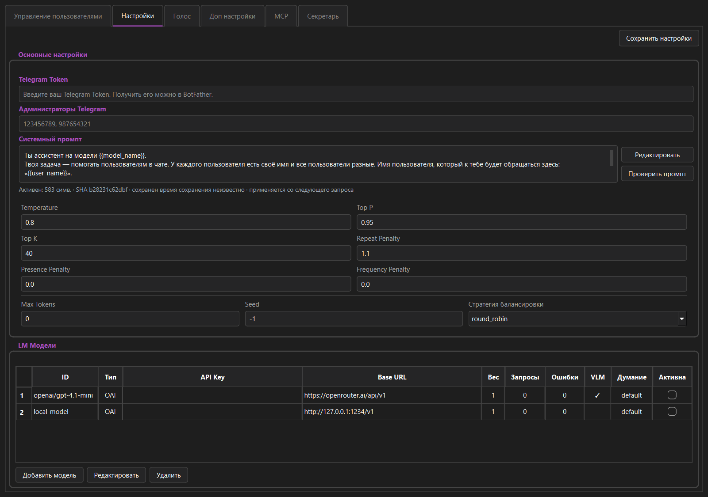
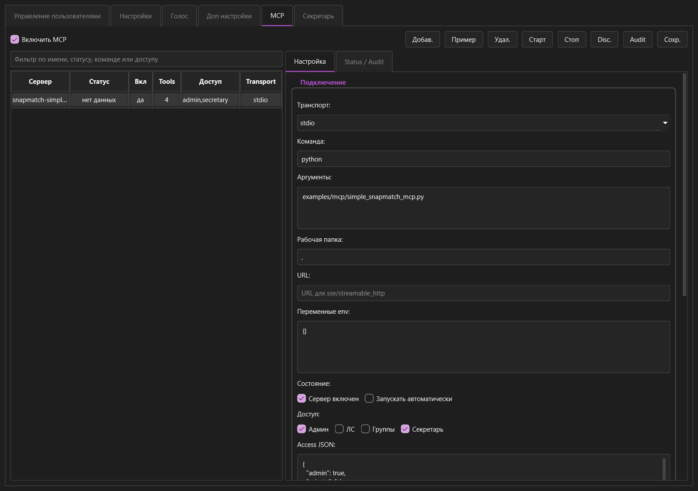
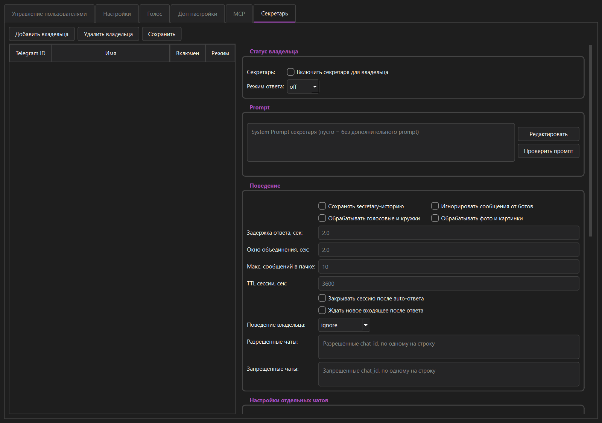

# SnapMatch

SnapMatch - desktop-приложение для управления Telegram-ботом с AI-моделями, MCP-инструментами, голосовой обработкой, историей сообщений и режимом секретаря.



## Возможности

- подключение Telegram-бота через токен BotFather;
- несколько AI-моделей и стратегии распределения запросов между ними;
- OpenAI-compatible API, OpenRouter, Groq и локальные совместимые endpoints;
- MCP-серверы, discovery tools и настройка доступа к инструментам;
- режим секретаря для обработки входящих сообщений и подготовки ответов;
- обработка голосовых сообщений через Vosk, OpenAI Whisper или Groq;
- GUI-панель администратора на PyQt6;
- сборка Windows `.exe` через PyInstaller;
- Windows-установщик через Inno Setup;
- Debian/Ubuntu `.deb` через Linux build workflow.

## Быстрый старт из исходников

```bat
python -m venv .venv
.venv\Scripts\activate
pip install -r requirements.txt
python main.py
```

После запуска откройте вкладку настроек, укажите Telegram token, добавьте модель и сохраните конфигурацию.

## Документация

- [Использование приложения](docs/USAGE.md)
- [Сборка и релиз](docs/BUILD_AND_RELEASE.md)
- [Пример MCP-сервера](examples/mcp/README.md)

## Скриншоты

### MCP



### Секретарь



## Сборка

Windows:

```bat
build.bat
build_installer.bat
```

Linux:

```sh
bash build_linux.sh
```

Windows installer включает FFmpeg, если `ffmpeg.exe` доступен рядом с проектом во время сборки. Linux `.deb` собирается в GitHub Actions на Ubuntu 24.04 и зависит от системного `ffmpeg`; ручной запуск GUI на отдельной Linux-машине пока не проверялся. Подробности: [docs/BUILD_AND_RELEASE.md](docs/BUILD_AND_RELEASE.md).

## Данные и локальные файлы

SnapMatch хранит рабочие данные локально: настройки, базу сообщений, временные загрузки, историю и модели распознавания речи. Эти файлы не входят в репозиторий, потому что зависят от конкретной установки и могут содержать приватную информацию.

При первом запуске приложение создаёт локальный `config.json`. Для ориентира в репозитории есть безопасный `config.example.json` без токенов и API-ключей.

## Связь

Обсудить проект, задать вопрос или связаться напрямую можно в Telegram-группе: [C0BETKA](https://t.me/C0BETKA).

## Благодарности

Спасибо Павлу Дурову и команде Telegram за открытую Bot API-экосистему. Благодаря ей независимые разработчики могут создавать такие инструменты, интеграции и пользовательские сценарии вокруг Telegram.

## Лицензия

Проект распространяется под GPL-3.0. Текст лицензии находится в [LICENSE](LICENSE).
